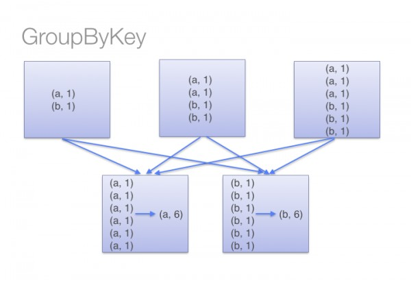
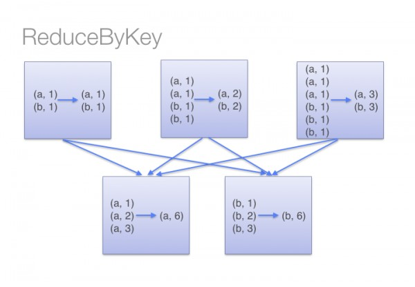

# Apache_Spark_Snippets
Apache spark Details

#Basic Operations on RDD
    > Accumulators
    > CombineByKey
    > FoldBy
    > FoldByKey
    > GroupBy
    > GroupByKey : The groupByKey can cause out of disk problems as data is sent over the network and collected on the reduced workers. You can see the below example.
    > Reduce : Whereas in reducebykey, Data are combined at each partition, only one output for one key at each partition to send over the network. reduceByKey required combining all your values into another value with the exact same type.
    > ReduceBy
    > map 
    > mapValues

-----------------------------
#### Group By and Reduce By
> sparkContext.textFile("hdfs://")
.flatMap(line => line.split(" ") )
.map(word => (word,1))
.groupByKey()
.map((x,y) => (x,sum(y)))

> sparkContext.textFile("hdfs://")
.flatMap(line => line.split(" "))
.map(word => (word,1))
.reduceByKey((x,y)=> (x+y))

-----------------------------